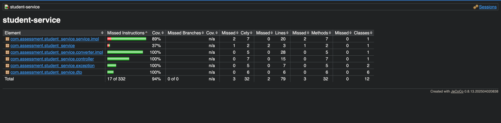

# 🏫 Student Service - Spring Boot Microservice

This is a Spring Boot-based microservice to manage student information and handle basic student-related operations such as adding students, deleting them, and listing all students (with pagination).

---

## 📦 Tech Stack

- Java 21
- Spring Boot 3.2.x
- Spring Web
- Spring Data JPA
- H2 In-Memory Database
- SpringDoc OpenAPI (Swagger)
- Lombok

---

## 🚀 How to Run the Project

### 🔧 Prerequisites

- Java 21
- Maven 3.8+
- IDE like IntelliJ or VS Code (optional)

### 🏁 Steps

1. **Clone the repository:**
   ```bash
   git clone https://github.com/shaxzodDev/student-service.git
   cd student-service
   
2. **Build the project:**
    ```bash
   mvn clean install

3. **Run the application:**
    ```bash
   mvn spring-boot:run

4. The service should start on port 8080 (default).

## 🧪 API Testing

### 📘 Swagger UI

Once the app is running, open:

🌐 [http://localhost:8080/swagger-ui.html](http://localhost:8080/swagger-ui.html)

Use Swagger UI to:
- View API endpoints
- Try out requests like `POST`, `DELETE`, `GET` (with pagination)
- Explore request/response schemas and models

---

### 📮 Postman Collection

A Postman collection is included to test all APIs.

🧾 **[Download Postman Collection](https://drive.google.com/file/d/1g4xmNcZw0adki_hMFGd8QuerdwW0Wmpf/view?usp=sharing)**

#### How to Use:

1. Open **Postman**
2. Click **Import** → choose the `.json` file
3. Set environment variables (if needed), or use base URL: `http://localhost:8080`
4. Test endpoints like:
    - `POST /students` – Add a new student
    - `GET /students` – List students with pagination
    - `DELETE /students/{id}` – Delete a student by ID

---

## 🛠 Configuration

### H2 Console

To view the in-memory H2 database in a web UI, go to:

🌐 [http://localhost:8080/h2-console](http://localhost:8080/h2-console)

**Database settings:**
- **JDBC URL:** `jdbc:h2:mem:studentdb`
- **Username:** `sa`
- **Password:** *(leave blank)*

---

## Running Tests and Checking Code Coverage

### Run all tests
   ```bash
   mvn clean test
   ```

### Run tests and generate code coverage report
   ```bash
   mvn clean verify
   ```

### View JaCoCo code coverage report
After running the tests with coverage, open the report located at:
   ```bash
   target/site/jacoco/index.html
   ```

